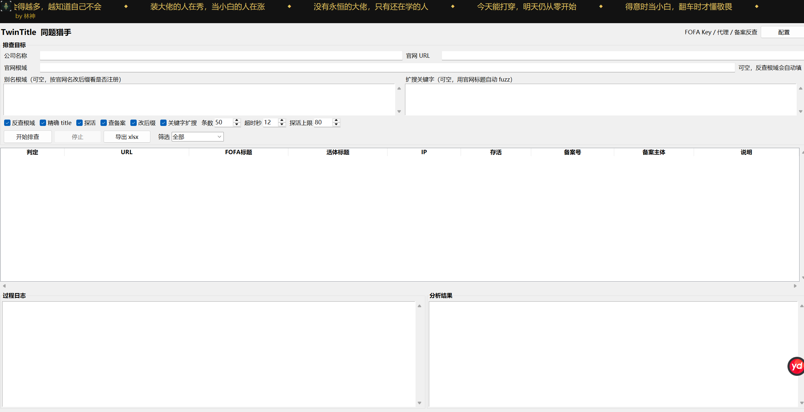

<p align="center">
  
</p>

<h1 align="center">TwinTitle</h1>

<p align="center">
  <b>同题猎手</b> · same-title phishing hunter<br>
  <i>by 林神</i>
</p>

<p align="center">
  <a href="README.md">English</a> · <a href="README.zh-CN.md">中文</a> · <a href="CHANGELOG.md">Changelog</a>
</p>

<p align="center">
  <a href="https://github.com/everybelief/TwinTitle/releases/latest"><b>Download Windows exe</b></a>
</p>

<p align="center">
  
</p>

---

Give it company legal names, one per line. TwinTitle reverses public ICP roots, probes the official title, searches FOFA for the same / lookalike titles, live-checks hits, and exports an xlsx.

```
公司全称
  → icplishi ICP reverse
  → official title + lookalike fuzz
  → FOFA exact title + keywords
  → live probe (curl if Clash fake-ip)
  → chinaz ICP on lookalikes
  → TLD aliases
  → verdict + xlsx
```

Roots must be real ICP domains. Emails, `@`, `0.0.0.0` are dropped. No Hunter / Quake / WHOIS / 爱企查.

## Usage

No Python: grab `TwinTitle.exe` from [Releases](https://github.com/everybelief/TwinTitle/releases/latest), open **配置**, paste your FOFA key.

From source:

```text
copy config.example.json config.json
pip install -r requirements.txt
```

Double-click `启动.bat`. One company: roots / URL / keywords can stay empty. Batch: each company is reversed on its own. Results are grouped by company and verdict.

Keep `config.json` local. Do not commit it.

## Config

```json
{
  "fofa_key": "在这里填你的 FOFA API KEY",
  "fofa_mode": "official",
  "fofa_interval": 2,
  "proxy": "http://127.0.0.1:7897",
  "proxy_enable": false
}
```

| Field | Meaning |
| --- | --- |
| `fofa_key` | FOFA API key |
| `fofa_mode` | `official` |
| `fofa_interval` | Seconds between FOFA calls |
| `proxy` | Optional HTTP proxy |
| `proxy_enable` | Off by default. Live probe never uses the proxy |

## CLI

```text
python engine.py --validate
python engine.py --title "某某集团有限公司" --out out/result.xlsx
python engine.py --title "甲公司有限公司,乙公司有限公司" --out out/batch.xlsx
```

| Flag | Meaning |
| --- | --- |
| `--title` | Legal name; comma / newline for batch |
| `--official` | Official roots |
| `--url` | Official URL |
| `--alias` | Alias roots |
| `--keywords` | Extra keywords |
| `--out` | xlsx path |
| `--size` | FOFA size, default 50 |
| `--no-roots` | Skip ICP reverse |
| `--no-probe` | Skip live probe |
| `--no-icp` | Skip chinaz |
| `--no-suffix` | Skip TLD aliases |
| `--no-keywords` | Skip keyword FOFA |
| `--validate` | FOFA ping only |

## Output

Three sheets in `out\`: 结果, 分析, 查询语句.

| Tag | Meaning |
| --- | --- |
| 可疑钓鱼 | Live third-party, same / lookalike title |
| 可疑-被拦 | Lookalike, blocked |
| 可疑-不通 | In FOFA, dead now |
| 需人工 | Unclear |
| 测绘过期 | Indexed, not live |
| 博彩/冒备案 | Gambling / fake ICP |
| 自有 | Official |
| 排除 | Unrelated |
| 未见注册 | Alias TLD free |

A FOFA `0` only means the current index is empty.

## Layout

```text
启动.bat / run.cmd
ui.py
engine.py
config.example.json
assets/
tools/httpx.exe
tools/curl.exe
tools/lib/fofa_api.py
tools/lib/domain_icp.py
out/
```

ICP reverse: `https://icplishi.com/company/{name}/`.

## Author

**林神**

所谓的大佬，一辈子都以为自己是小白.

Changelog: [CHANGELOG.md](CHANGELOG.md).
